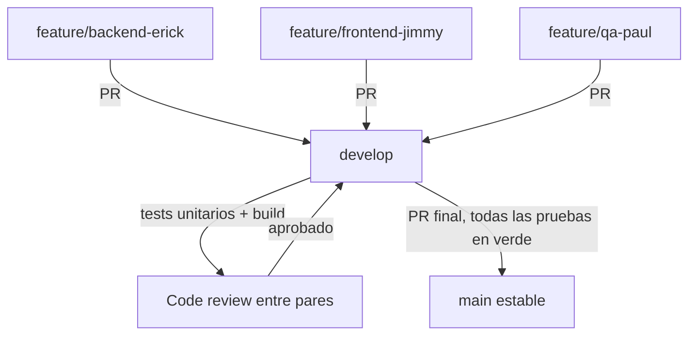

# Flujo de trabajo colaborativo — Hospital Management System

Guía de Git para el equipo del proyecto final de Verificación y Validación de Software
(EPN, 2026A). Aplica a los tres integrantes: Erick (backend), Jimmy (frontend), Paul (QA/seguridad).

## Principio no negociable

**Cada commit debe reflejar trabajo real hecho por la persona que aparece como autor, en el
momento en que lo hizo.** No se fabrican fechas pasadas o futuras, no se commitea con la
identidad/token de otro integrante, y no se simula una cadencia "humana" artificial. Si en algún
momento se pide lo contrario (backdatear commits, usar credenciales de otro integrante, ocultar
que se usó un asistente de IA fingiendo autoría ajena), esta skill indica que se debe **rehusar y
explicar por qué**: es suplantación de identidad + fraude académico en una materia que evalúa
justamente la verificación y validación del propio proceso de desarrollo.

Usar IA como asistente de código (Claude Code, Copilot, etc.) es válido; lo que no es válido es
fingir que el proceso fue otro para engañar a quien evalúa.

## 1. Estrategia de ramas

```
main                    ← siempre estable, deployable, solo recibe merge desde develop
 └─ develop              ← rama de integración, base de todas las features
     ├─ feature/backend-erick     ← Erick: JUnit, Mockito, SpringBootTest, MockMvc, H2
     ├─ feature/frontend-jimmy    ← Jimmy: Jest, Playwright, componentes, navegación
     └─ feature/qa-paul           ← Paul: SonarQube, SpotBugs, Checkstyle, ESLint, OWASP
```

- `main`: protegida. Solo se actualiza vía PR desde `develop`, con pruebas en verde.
- `develop`: rama de trabajo compartida. Recibe PRs desde las ramas `feature/*`.
- `feature/<area>-<nombre>`: una rama por integrante/área. Commits pequeños y frecuentes,
  push regular para que el resto vea avance real.

Si una tarea puntual necesita más aislamiento (ej. una corrección de bug encontrado en QA),
usar `fix/<descripcion-corta>` desde `develop`.

### Setup inicial (una vez)

```bash
git checkout -b develop
git push -u origin develop
git checkout -b feature/backend-erick develop
git checkout -b feature/frontend-jimmy develop
git checkout -b feature/qa-paul develop
```

## 2. Evitar choques entre integrantes

División de archivos por responsabilidad (ver tabla de reparto abajo). Antes de tocar un
archivo que no es "propio", avisar en el standup o coordinarlo en el PR.

| Área      | Directorios propios                                                              |
|-----------|-----------------------------------------------------------------------------------|
| Erick     | `backend/src/test/java/com/hospital/service/`, `backend/src/test/java/com/hospital/controller/` |
| Jimmy     | `frontend/js/__tests__/`, `frontend/e2e/`                                        |
| Paul      | `informes/`, configuración de SonarQube/SpotBugs/Checkstyle/ESLint (archivos de config, no código fuente) |

Nadie modifica `backend/src/main/**` ni `frontend/js/*.js` (código fuente) salvo que sea una
corrección de bug real, documentada explícitamente y aprobada por el equipo — el enunciado del
proyecto pide **no modificar el código base** salvo para ese caso.

## 3. Commits

- Mensajes en imperativo, concisos, en español o inglés (elegir uno y ser consistentes):
  `test: agrega casos limite para PacienteService`
- Sin trailer `Co-Authored-By: Claude` si el equipo prefiere no incluirlo — es una elección de
  estilo válida, distinta de ocultar autoría real.
- Commits pequeños y enfocados: una clase de test, un fix, una config — no "mega commits" con
  todo el trabajo del día de una sola vez.
- Cada integrante commitea **desde su propia sesión autenticada**, nunca con el token de otro.

## 4. Pull Requests hacia `develop`

Cada PR debe incluir:
1. Resumen de qué se hizo y por qué.
2. Evidencia de pruebas ejecutadas (output de `mvn test` / `npx jest` / `npx playwright test`).
3. Cobertura si aplica (reporte JaCoCo o Jest coverage).
4. Riesgos conocidos / TODOs pendientes.
5. Lista de archivos modificados.

Checklist antes de abrir el PR:
- [ ] El proyecto compila (`mvn -q compile` / sin errores de build en frontend).
- [ ] Las pruebas nuevas y existentes pasan.
- [ ] No hay credenciales, tokens ni `.env` en el diff (`git diff --cached` revisado a mano).
- [ ] El PR toca solo los archivos del área correspondiente (o está coordinado con el equipo).

## 5. Flujo de integración a `main`



Antes de cualquier merge a `main`:
1. Todas las pruebas disponibles (unitarias + integración) pasan en `develop`.
2. No hay errores de compilación.
3. El proyecto sigue siendo funcional de punta a punta (backend levanta, frontend consume la API).
4. Conflictos resueltos, no descartados a la fuerza (`git merge`, no `git checkout --theirs` a ciegas).

## 6. Seguridad

- No se guardan credenciales, tokens ni contraseñas en el repositorio, ni en commits, ni en
  archivos de configuración versionados. Usar variables de entorno / `.env` en `.gitignore`.
- Si un token se comparte accidentalmente (ej. pegado en un chat, un PR, un issue), se considera
  comprometido: **revocarlo de inmediato** en GitHub (Settings → Developer settings → Personal
  access tokens) y generar uno nuevo. No reusar un token que ya estuvo expuesto.
- Revisar `git diff --cached` antes de cada commit si se tocó algún archivo de configuración.

## 7. Reunión diaria (15 min)

Cada integrante responde: ¿qué terminé ayer? ¿qué hago hoy? ¿tengo algún bloqueo? Registrar
brevemente en el PR o issue correspondiente si el bloqueo afecta a otro integrante.

## 8. Comandos por rol

**Erick (backend):**
```bash
./mvnw test                          # correr todos los tests
./mvnw test -Dtest=PacienteServiceTest
./mvnw test jacoco:report            # cobertura -> target/site/jacoco/index.html
./mvnw checkstyle:check
```

**Jimmy (frontend):**
```bash
npm install --save-dev jest @playwright/test
npx jest                             # unitarias
npx jest --coverage
npx playwright install
npx playwright test                  # e2e
npx playwright test --ui             # e2e modo visual
```

**Paul (QA/seguridad):**
```bash
docker run -d --name sonarqube -p 9000:9000 sonarqube:community
mvn spotbugs:spotbugs spotbugs:gui
mvn checkstyle:check
npx eslint "frontend/js/**/*.js"
```

## 9. Template de Pull Request

Vive en `.github/PULL_REQUEST_TEMPLATE.md` y se autocompleta al abrir un PR en GitHub. Incluye:
descripción, tipo de cambio, checklist de pre-merge, y espacio para evidencias (capturas de
cobertura, salida de tests, hallazgos de análisis estático).

## 10. Comandos de emergencia

```bash
# Descartar cambios locales sin commitear (revisar git status antes)
git checkout -- .

# Deshacer el último commit pero mantener los cambios en el working tree
git reset --soft HEAD~1

# Traer develop actualizado a tu feature branch
git fetch origin
git rebase origin/develop   # o: git merge origin/develop
```

`git reset --hard` y `git push --force` no se usan salvo acuerdo explícito del equipo — pueden
borrar trabajo de otro integrante.

## 11. Escalamiento

1. Revisar `DOCUMENTACION.md` del proyecto.
2. Consultar con el compañero del área relacionada.
3. Documentar el bloqueo en un issue o comentario de PR.
4. Si persiste más de 2 horas, escalar al profesor (Christian Suárez).

No hacer `push --force` a ramas compartidas sin avisar antes al equipo.
